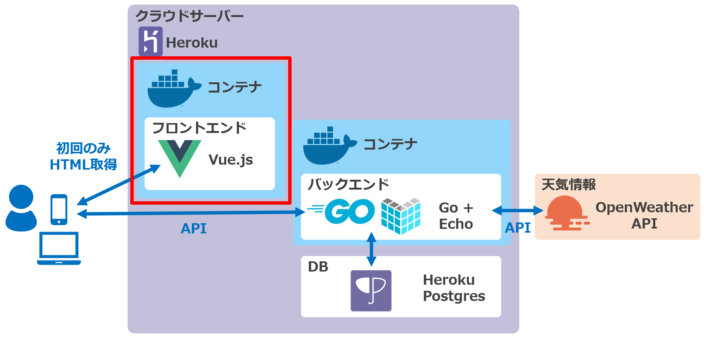

# TripWeather
旅行先のこの先一週間の天気予報を現在地と比較して見ることができるWebサイトです。

現在地・目的地をお気に入りに登録しておくことで、次回以降は簡単に天気予報を確認することができます。

レスポンシブ対応のため、スマホ/PCどちらからでも利用可能です。

 

## サイトURL
https://trip-weather-frontend.herokuapp.com/
 

## 構成図
このリポジトリは以下赤枠部分のコードを含みます。  
 
 
（バックエンドはGo+Echo版、Rails版の2種類、フロントエンドは1種類のみ。）  
 

関連するリポジトリは以下の3つです。
- **フロントエンド（このリポジトリ）**  
  https://github.com/yakitori99/trip-weather-frontend

- バックエンド①（Go+Echo版）  
  https://github.com/yakitori99/trip-weather-backend

- バックエンド②（Rails版。機能はGo+Echo版と同様）  
  https://github.com/yakitori99/trip-weather-backend-rails

## 主な使用技術（アプリケーション全体）
### フロントエンド
- Vue.js 2.6
  - Vuex (状態管理ライブラリ)
  - Vue Router (SPA構築用ルーティング制御ライブラリ)
  - Vuetify (UIライブラリ)
  - vue-toasted (トースト表示用ライブラリ)
- chart.js (グラフ表示)
- axios (非同期通信)
- nginx (Webサーバ)
- Font Awesome (アイコン)

### バックエンド①
- Go 1.16
  - Echo (Webフレームワーク)
  - GORM (ORMフレームワーク)
  - logrus (ログ出力用ライブラリ)
  - go-simplejson (jsonのパース用ライブラリ)
  - apitest (APIテスト用ライブラリ)

### バックエンド②
- Ruby 3.0 / Ruby on Rails 6.1
  - Puma (Web/アプリケーションサーバ)
  - Faraday (HTTP通信用ライブラリ)
  - parallel (並行処理用ライブラリ)

※バックエンド①と②は全く同じ機能です。学習のため、2つの言語でそれぞれ作成しました。

### インフラ
- Heroku
- Heroku Postgres
- Docker / docker-compose

### API
- OpenWeather API
 

## 機能一覧（アプリケーション全体）
- 天気表示機能
  - 現在地の昨日、今日の天気
  - 目的地の今日の天気、明日から1週間の天気予報
- お気に入り登録機能
- お気に入り一覧表示機能
  - ページネーション
  - ソート
- お気に入りから選んで天気を表示する機能
 

## 工夫したこと（フロントエンド）
- SPA(Single Page Application)構成とし、ページ遷移を高速化した
  - お気に入り一覧のソート・ページネーションも、サーバへの問合せ無しで高速に動作する仕様とした
- 高速化のため、2つ以上のAPIを呼び出すときは並行処理とした
- 天気情報APIへの問合せは時間がかかる場合があるため、ローディング中のアイコンを表示し状況をわかりやすくした
- アイコンを使って、なるべくわかりやすいUIとした
- 気温の変化が直感的にわかるよう、chart.jsを使ってグラフで表示した
- Dockerイメージ軽量化のため、マルチステージビルドを行い、リリース用イメージにはビルド済み実行ファイルのみを置いた